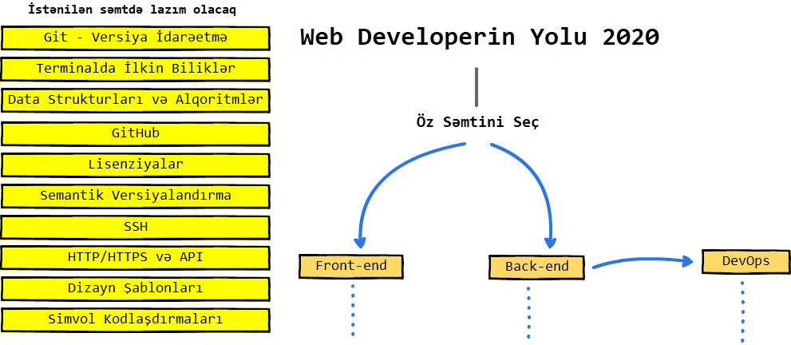

>*Bütün sxemlər Balsamiq istifadə edilərək redaktə edilmiş və tərcümə olunmuşdur. Sxemlərdə yazılan fikirlər və tövsiyələr olduğu kimi saxlanılıb və hamısı [orijinal müəllifə](https://github.com/kamranahmedse/developer-roadmap) və layihəyə dəstək olan şəxslərə aiddir. Bu versiya isə daimi olaraq orijinalla sinxronlaşdırılacaqdır. Məqsəd yeni başlayan və xüsusilə dil çətinliyi olanlar üçün heç olmasa yol seçməklərində yardımçı olmaqdır. Əgər nəsə əlavə və dəyişiklik təklifiniz olsa orijinal və ya bu layihəni fork edib requestlərinizi göndərə bilərsiz.*

## Giriş

## Frontend

## Back-end Roadmap 

>Hazırlanır...

## DevOps Roadmap

>Hazırlanır...

